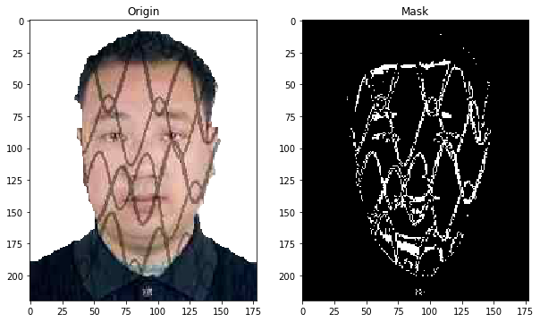
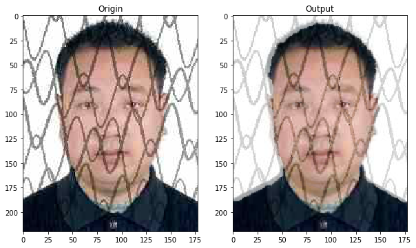

# RecoverIDCardPhoto
Use Dcgan to recover ID Card Photo

## About
This is a side project which made for a big traffic company to let them recover
Old Chinese ID Card.

Old Chinese ID Card has complex pattern on it and cannot be easy recognize.

In this project, I use dcgan and Adam optimizer, the first step is use dcgan as a ID Card photo generate, the second step is use adam optimizer to get the psnr less noise.Finally the network could get a prepare ID Card photo in the prepare noise without pattern.

## 关于
这个项目是我为国内某家大型交通运输公司开发的，用于识别中国第一代身份证照片，旧版的身份证照片覆盖了很严重的花纹，在扫描后无法被识别。

在这个项目中，我使用了深度卷积生成对抗网络和 Adam 优化器，第一步训练 DCGAN 是它得到一个身份证照片生成器，第二部是使用 Adam 优化器来拟合一个合适的噪声，是得网络输出的照片和有网纹的照片 psnr 差异最小，最后得到的噪声输入到网络中得到的结果就是一个不带网纹的结果


## Run
which use flask to offer a Restful Api, just use below:

```shell
python server.py
```

## Demo
Origin (With pattern)





## Final
私有数据集
Private dataset
